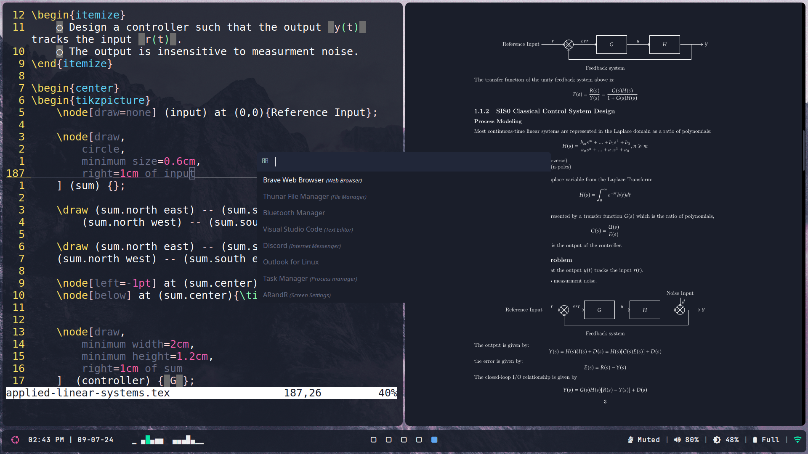

# dotfiles

A collection of dotfiles for my personal i3 linux config 

*taking notes in LaTeX with zathura and vimtex (also rofi)*

Using:
- alacritty
- thunar
- nvim
- picom
- polybar
- rofi
- zathura

You may need to install nerdfonts symbols and whale theme (find them in the .tar files).
